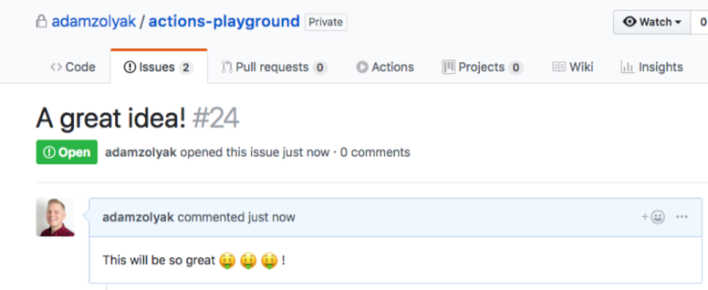
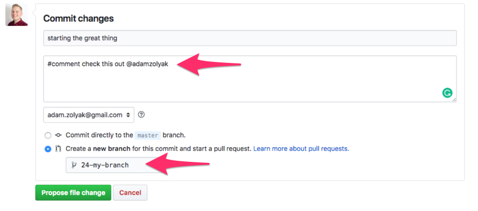
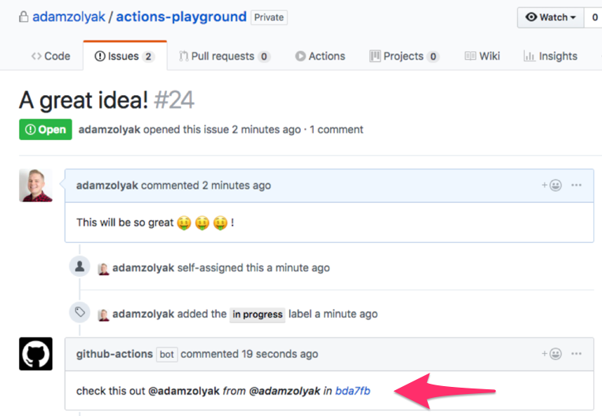

# 💬 Commit Issue Commenter - GitHub Action

A [GitHub Action](https://github.com/features/actions) that helps your team communicate and collaborate before you open a pull request.

## How It Works

This GitHub Action runs when an [`push` event webhook](https://developer.github.com/v3/activity/events/types/#pushevent) is fired in your GitHub repo. The action checks for a `#comment your message goes here` in commit messages and added them as a comment on the related issue if the branch name includes the issue number in the `#issueNumber-something-something` format. You can also notify other people by @mentioning their GitHub username in the comment `#comment your message goes here and notifies @person`.

Since GitHub Actions currently only support actions within the same repo, this action currently only supports comments in on issues and commit in the same repo.

## Installation

To use this GitHub Action, you must have access to [GitHub Actions](https://github.com/features/actions). GitHub Actions are currently only available in private beta (you must [apply for access](https://github.com/features/actions)) and only work in private repos.

To setup this action:

1. Create a `.github/main.workflow` in your GitHub repo.
2. Add the following code to the `main.workflow` file and commit it to the repo's `master` branch.

```
workflow "Commit Issue Commenter" {
  resolves = ["Comment From Commit"]
  on = "push"
}

action "Comment From Commit" {
  uses = "adamzolyak/commit-issue-commenter-action@master"
  secrets = ["GITHUB_TOKEN"]
}
```

3. Whenever you push changes to GitHub, the action will run!

## Examples

Example of issue before work has started:


Example of creating a branch referencing issue #24 and adding a comment in the commit message:


Example of issue with comment from commit:


## Contributing

If you have suggestions for how this GitHub Action could be improved, or want to report a bug, open an issue! Or pull request! We'd love all and any contributions. For more, check out the [Contributing Guide](CONTRIBUTING.md).

## License

[ISC](LICENSE) © 2018 Adam Zolyak <adam@tinkurlab.com> (www.tinkurlab.com)
